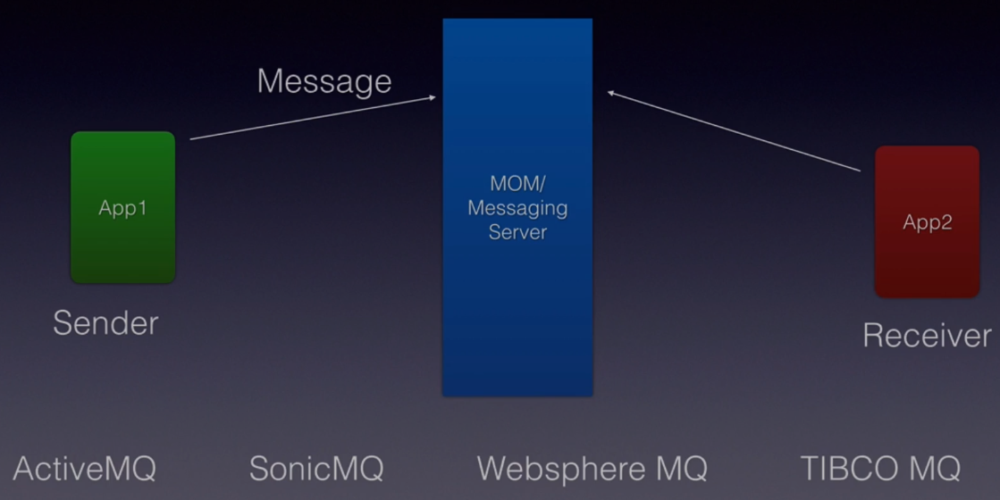
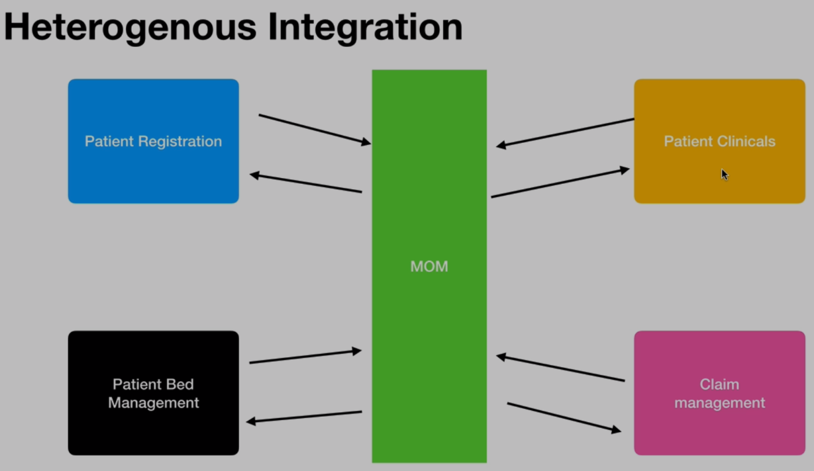
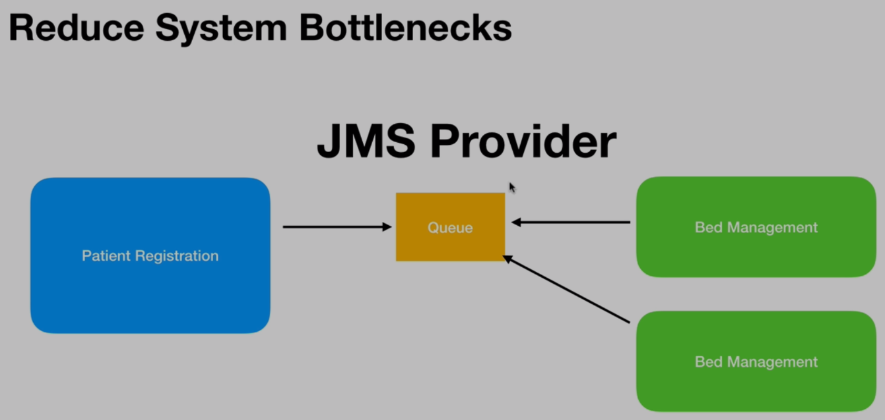
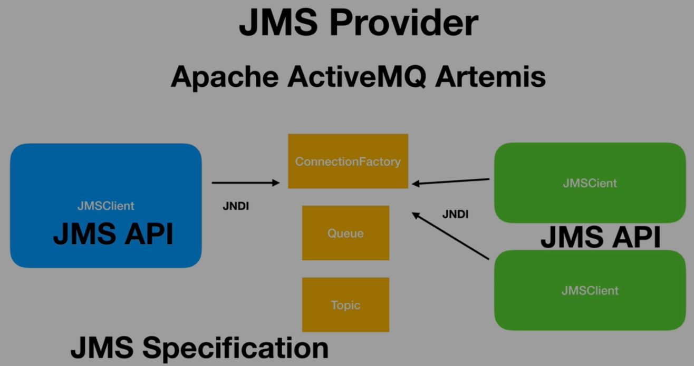
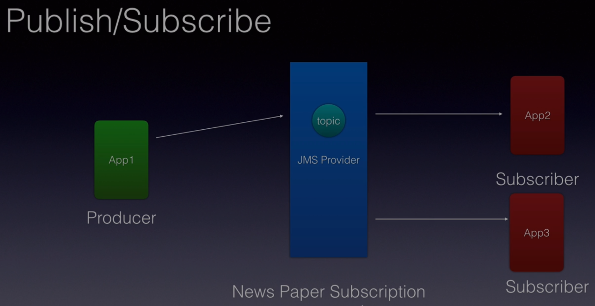

# Java Messaging Service, JMS Fundamentals
### by Bharath Thippireddy, <span style="color:green">Udemy</span>

The courser will make use of APIs JMS 1.x and JMS 2.x. For the JMS provider we'll use **Apache ActiveMQ Artemis**.
We will deploy a Java EE application in Jboss.


Outline:
1. What is messaging and why to use them.
2. What is JMS
3. Types of messages: Point-to-point (P2P) and Publisher-Subscriber (PUB-SUB)
4. Anatomy of a message: Headers, Properties and Payload
5. Load balancing in P2P.
6. Durable and Sharable Subscriptions in PUB-SUB
7. Filtering messages
8. Message guarantee: Acknowledgment and Transaction

The course is divided into 14 sections. I will organize my notes per section.

## 2. Messaging Basics
Messaging is the process of exchanging business data or information across applications, or across components within the same application. The components of a messaging system are:
1. The message: contains the business data as well as networking or routing headers.
2. Sender (an application)
3. Receiver (an application)
4. The Messaging Server, or MOM (Message Oriented Middleware): takes the incoming message and ensure it is delivered to the proper receiver.

The Messaging Server provides useful services such as fault tolerance, load balancing, scalability, transaction management among others. Example of MOMs (JMS providers) are:
- Apache ActiveMQ
- SonicMQ
- IBM WebsphereMQ
- TibcoMQ
- RabbitMQ

  
  
## Messaging advantages
A messaging server decouples the sender and receiver applications allowing for heterogeneous integration. Each application can be a service or a micro-service, developed in different programming languages and running on completely different environments. Moreover, they can be replaced at any time, as they will all fallow the same (abstract) contract set by the MOM. This **increase the flexibility** of our application, also good for microservices.



Before messaging came in, applications communication was made through a database or making remote procedural calls. This introduced tight coupling among applications ?. Messaging brought in the desired **loose coupling**, making applications need to know nothing about each other. All the request and response process is now mediated through the MOM. 

Compared to web services (HTTP request/response), MOMs are more reliable as request and response messages are persisted, so there are much fewer chances they are lost.

Messaging also **reduce system bottlenecks** and **increase scalability**. If a queue only has one receiver application and there are much more messages in the queue than the app can process, we can introduce more instances of the same consumer application set to listen the same queue. In other words, we can spin off more instances of the consumer application as the load increase, and they will work asynchronously !




## What is JMS
JMS is a specification for messaging services in Java applications. It is maintained by Oracle. All Messaging Servers, irrespective of the vendor, must implement it. Developers use the APIs JMS provides. The current version of JMS is 2.0, and it is a big improvement over the earlier version 1.2.

**JMS is for messaging what JDBC is for databases**.

In this course we will use Apache ActiveMQ Artemis as JMS provider. It is a JMS client. Once installed we need to create a broker ? and run it. We'll need to create the <u>administered objects</u>:
- ConnectionFactory
- Queue (for P2P messaging)
- Topic (for PUB-SUB messaging)

The application will access the administered objects through **JNDI** (Java Naming and Directory Interface), from both the producer and the consumer side.



The JMS provider will give us durability, scalability, acknowledgment, transaction management, clustering and more.

## The two messaging models
JMS supports two types of messaging models: Point-to-Point and Publish/Subscriber.

### Point-to-Point
The Point-to-Point (P2P) messaging model allows sending and receiving messages both synchronously and asynchronously, through channels called **queues**. The JMS provider allow creating queues. There will be a Producer, or Sender, application adding messages to the queue. And there will be a Receiver, or Consumer, application taking the messages from the queue.

In Point-to-Point messaging the message that is put into the queue is consumed by only one application and then removed from the queue. The JMS provider will ensure this.
 
P2P messaging supports **asynchronous fire and forget**, which means that the producer application will send the message to the JMS provider and will forget it. The consumer application will then consume and process it however it wants. However, it also supports **synchronous request/replay messaging**. In this case, after the producer application sends a message to the queue, the consumer application receives it, process it, and sends a message back to the producer app. through a different queue. The producer will read this message as a response.


### Publish/Subscribe
In the Publish/Subscribe (PUB-SUB) messaging model the messages are published to a virtual channel called **topic**. We will have only one producer, but many consumers called "Subscribers". The same message will be received my multiple subscribers (applications). 

In the PUB-SUB messaging model messages are automatically broadcasted to the consumers, without them having to request or pull the topic. In other words, it is a push model. So, after the producer sends the message to the topic, the JMS provider will ensure the message is sent to all the subscribers subscribed to that topic.




## Apache ActiveMQ installation
I installed Apache ActiveMQ 2.19 by downloading it from https://activemq.apache.org/components/artemis/download/ and unzipping it in /opt.

Once "installed" I need to go to `/opt/apache-artemis-2.19.0/bin/` and run 
```text
$ ./bin/artemis create brokers/mybroker
```
to _create_ a **JMS broker**, or server. In this case the name I chose for the broker is "mybroker" . I decided to create my brokers inside the directory `/opt/apache-artemis-2.19.0/brokers/`, but they can be created anywhere. When creating the broker, user and password properties will be asked to be set, as well as whether we want to allow anonymous access to the broker.

Now go to the `bin` directory inside the created broker directory and run
```text
$ artemis run
```
sudo privileges may be needed depending on where we created the server. This command will create a set of predefined queues and topics on the fly. Startup logs will be printed out with all the  useful information about the started services, similar to when we start an application server such as Wildfly.

The file `mybroker/etc/broker.xml` will be a configuration file with lots of configurations, including queues and topics. We can edit this file directly, or the jndi.properties file of our project, to create queues. It seems that if we ask for a queue that doesn't extis, Artemis can create it for us in the fly.

## Components of the JMS 1.x API
The 7 important components (classes) of the JMS 1.x API are:
1. Connection Factory
2. Destination: a queue in case of P2P messaging, or a topic, in case of PUB-SUB messaging.
3. Connection
4. Session
5. Message
6. Message Producer
7. Message Consumer
 
The **ConnectionFactory** and the **Destination** are provided by the JMS provider, which will create and put them in the JNDI registry from where we can retrieve them. From the ConnectionFactory we get a Connection. From the Connection we then get a Session. 

A Session is a unit of work. We can create any number of session using a single connection to the JMS provider (server?). From the Session we can create a Message and a MessageProducer to send the message. In the consumer part of the application we'll also use a Session to create a MessageConsumer to consume the message. We will have queue producers/consumers and topic producer/consumer.

So we have JNDI tree -> ConnectionFactory -> Session -> Message -> MessageProducer or Consumer.

## Project setup
A pom file for our messaging example project can be:
```xml
<?xml version="1.0" encoding="UTF-8"?>
<project xmlns="http://maven.apache.org/POM/4.0.0" xmlns:xsi="http://www.w3.org/2001/XMLSchema-instance"
         xsi:schemaLocation="http://maven.apache.org/POM/4.0.0 https://maven.apache.org/xsd/maven-4.0.0.xsd">
    <modelVersion>4.0.0</modelVersion>

    <groupId>com.example</groupId>
    <artifactId>jmsfundamentals</artifactId>
    <version>0.0.1-SNAPSHOT</version>
    <packaging>jar</packaging>

    <name>JMS Fundamentals</name>
    <description>Demo project for JMS</description>

    <properties>
        <java.version>1.8</java.version>
        <project.build.sourceEncoding>UTF-8</project.build.sourceEncoding>
    </properties>

    <build>
        <plugins>
            <plugin>
                <groupId>org.apache.maven.plugins</groupId>
                <artifactId>maven-compiler-plugin</artifactId>
                <version>3.8.1</version>
                <configuration>
                    <source>${java.version}</source>
                    <target>${java.version}</target>
                </configuration>
            </plugin>
        </plugins>
    </build>

    <dependencies>
        <dependency>
            <groupId>org.springframework</groupId>
            <artifactId>spring-context</artifactId>
            <version>5.2.0.RELEASE</version>
        </dependency>

        <dependency>
            <groupId>javax.annotation</groupId>
            <artifactId>javax.annotation-api</artifactId>
            <version>1.3.2</version>
        </dependency>

        <!-- https://mvnrepository.com/artifact/org.apache.activemq/artemis-jms-client-all -->
        <dependency>
            <groupId>org.apache.activemq</groupId>
            <artifactId>artemis-jms-client-all</artifactId>
            <version>2.6.4</version>
        </dependency>

    </dependencies>
</project>
```

The javax and Spring dependencies are not strictly needed, but I include them because I want to use Spring and annotations configuration. ActiveMQ will read a properties file `jndi.properties` in the resources' directory (in the class path). In this file we will specify the `InitialContext` class, as well as some other properties that will be used to look up for resources in the JNDI tree of the JMS server.

## Sending and receiving messages from a Queue

Our main class can be: 
```java

/**
 *  JMS 1.1 example. All the boilerplate code is removed with JMS 2.0
 *  */
public class FirstQueue {
  public static void main(String[] args){

    InitialContext initialContext = null;
    Connection connection = null;
    try {

      // obtain a reference to the root of the JNDI tree of the naming server
      // of the JMS server
      initialContext = new InitialContext();

      // get the resources in the JNDI tree we need
      Queue queue = (Queue) initialContext.lookup("queue/myQueue");
      ConnectionFactory connectionFactory = (ConnectionFactory) initialContext.lookup("ConnectionFactory");

      connection = connectionFactory.createConnection();
      Session session = connection.createSession();

      MessageProducer producer = session.createProducer(queue);
      MessageConsumer consumer = session.createConsumer(queue);

      TextMessage message = session.createTextMessage("I am the creator of my destiny");
      producer.send(message);

      System.out.println("Message sent: " + message.getText());

      /** Now we'll consume the messages  */

      // start the flow of messages in the queue towards the consumers.
      // tell the JMS provider we are ready to consume the messages
      connection.start();

      // here we block. This is synchronous.
      // throw exception if message is not received after 5 seconds
      TextMessage messageReceived = (TextMessage) consumer.receive(5000);

      System.out.println("Message received: " + messageReceived.getText());

    } catch (NamingException e) {
      e.printStackTrace();
    } catch (JMSException e){
      e.printStackTrace();
    } finally {
      if (initialContext != null) {
        try {
          initialContext.close();
        } catch (NamingException e) {
          e.printStackTrace();
        }
      }
      if (connection != null) {
        try {
          connection.close();
        } catch (JMSException e) {
          e.printStackTrace();
        }
      }
    }
  }
}
```
The `jndi.propeties` file used is:
```text
# initial context class
java.naming.factory.initial=org.apache.activemq.artemis.jndi.ActiveMQInitialContextFactory

# a ConnectionFactory resource
# default location where the JNDI server run??
connectionFactory.ConnectionFactory=tcp://localhost:61616

# a queue resource
queue.queue/myQueue=myQueue
```
I think that when we will initialize the `InitialContext` in our code, we will get such object from the factory class we have specified in property `java.naming.factory.initial`. And this factory class is specific to the JMS vendor we are using.

In the queue name specification, the first "queue." indicates it is a queue type of administered object. There is no queue named "myQueue". It will be created dynamically at run time. However, I don't understand whether the JNDI name will be "queue/myQueue" (left member) or "myQueue" (right member). In the code we use "queue/myQueue" as argument to `lookup()` anyway, buh.

These are properties that the ArtemisMQ JMS broker host needs to setup a JNDI tree. I'm not sure whether these properties will just be that, properties to be loaded by our application, or will also create bindings and resources in the JMS server. But I think it defines bindings with the names and types we specify. For example, the line:
```text
connectionFactory.ConnectionFactory=tcp://localhost:61616
```
defines a resource of type "connectionFactory" with name "ConnectionFactory" and with value "tcp:://localhost:61616".

**---->** For the case of the queue, the teacher said it is created by the JMS provider the first time we `lookup()` for it in our code. May be the Connection Factory is also created the first time we lookup for it, buh.

When we create an instance of InitialContext with
```java
initialContext = new InitialContext();
```
it will automatically use the information defined in the application.properties file.  


## Sending and receiving messages from a Topic
Sending and receiving messages form a Topic follows the same pattern as for a Queue:
1. Obtain the reference to the `InitialContext`.
2. Retrieve the Topic or Queue resource, as well as the ConnectionFactory resource, invoking with `lookup()` from the initial context and the resource names.
3. Create a Session from the Connection
4. Create MessageProducer and MessageConsumer from the Session and passing the destination queue or topic
5. Create a TextMessage from the Session.
6. Send the TextMessage with the producer
7. start the connection, so the consumers can receive messages from the queues
8. receive the TextMessage with the consumers invoking `.receive()`

Notice that consumers will only receive messages sent to the topic after they have subscribed.

Question: When all consumers subscribed to the queue have received a message, is that message removed from the queue?


_________
# JNDI
### "Java Programming 24-hour Trainer", Yakov Fain
Application Servers can host a set of ready-to-use Java objects that enterprise applications can request and use. These objects will be pre-created and published in the server under some name, so the application can look up them, without needing to create them over and over again. It is like a registry of objects.

**Java Naming and Directory Interface (JNDI)** is about registering and finding objects in distributed applications (enterprise applications deployed in one or many application servers, or standalone applications communicating with application servers or JNDI servers of some application). It is an API (a standard) that can be used for binding and accessing objects located in any Java EE or specialized _naming server_ that implement this standard API. Various software vendors (eg. JMS vendors) offer specialized "directory assistance software" that implement the JNDI API.

Every Java EE application server comes with an administration console that allow you to manage (create?) objects in a _JNDI tree_. In the JNDI tree we publish and look up _administered objects_, which are objects configured by the server administrator. Examples of administered objects are database connection pool (Data Source) as well as connection factories and destinations (queues and topics) in JMS servers. Instead of objects, we can also publish any information that allows retrieving it somehow.

## Naming and Directory service
A **_naming service_** enables you to add, change or delete names of objects that exist in some _naming hierarchy_, so other Java classes can look them up to find their location. For example, the directory of books in a library has the names of the physical locations of the books in the shelves, where we can go and get the books.

A naming service provides a unique name for each entry that is registered, or _bound to_, this service. Every naming service has one or more _contexts_. A context is like a point in a directory tree in which we have other child directories. There will be one, and only one, root context, or node, called _initial context_, like the root directory in a disk. 

All objects in the JNDI tree will have a name by which we look them up. We can therefore call the tree a _naming tree_ as well. A **_directory service_**, on the other hand, enables us to search the naming tree by object attributes, rather than by object name. For example, imagine an object that represents a computer connected to a network. The object may have the attributes domain name, IP address and listening port. If this object is registered in a directory service, we may look it up by its domain name (eg. amazon.com) and then obtain it's IP and port. DNS servers do exactly this.

Naming and directory services are said to be provided by naming and directory servers, respectively.

To allow client code to do look ups in a JNDI, or naming, tree, there has to be a process that initially binds the objects to the naming tree. This can be handled via a server administration console, or from client code that binds names to a names, or directory, server, of some software that has one. 

Java EE servers bind such objects as EJB, Servlets, JMS Connection Factories, and JDBC database connection pools to their naming servers during startup. They may have some of these bindings already predefined.

All classes and interfaces that support JNDI are located in the package `javax.naming`.

## The InitialContext class
<u>The class `InitialContext` represents the root of a JNDI tree in a naming server</u>. Once a particular resource has been bound to this tree, there are two ways of getting a reference to it:

- If a program is deployed in a Java EE server, we can inject the JNDI resource into it by using the `@Resource` annotation. It is also possible to make a `lookup()` on the `InitialContext` object.
- If an external Java program needs a JNDI resource of an application server, it has to get a reference to an `InitialContext`  of that application server, and then invoke the method `lookup()`, passing as argument the name of the desired resource. This may be the case of a standalone messaging program that needs to get a reference to the messaging queues bound to the JNDI tree of an application server, or the JNDI tree of a JMS server.

Explicit instantiation of the `InitialContext` is needed only if we are planning to use `lookup()` as opposed to resource injection.

When a Java program runs inside an application server, instantiating and getting a reference to the initial context is simply done by the line:
```java
Context initialContext = new InitialContext();
```
If on the other hand our program is outside the application server and we want to **get access** to the JNDI tree of the later through its InitialContext class, we need to pass some `Properties` to the InitialContext constructor. The specific properties vary from vendor to vendor of naming or directory service. For example, for the naming service of a Wildfly application server we may need to specify the location of the server, the <u>names of the vendor-specific classes implementing `InitialContext`</u>, and the access credentials:
```java
final Properties env = new Propeties();

env.put(Context.INITIAL_CONTEXT_FACTORY, "org.jboss.naming.remote.client.InitialContextFactory");

env.put(Context, PROVIDER_URL, "http-remoting://127.0.0.1:8080");

env.put(Context.SECURITY_PRINCIPAL, "Alex123");
env.put(Context.SECURITY_CREDENTIALS, "MySecretPwd");

Context initialContext = new InitialContext(env);
```
Similarly, if an external program needs to access the InitialContext object in a GlassFish server the code may look like this:
```java
final Properties env = new Properties();
env.setProperty("java.naming.factory.initial", "com.sun.enterprise.naming.SerialInitContextFactory");
env.setProperty("java.naming.factory.url.pkgs", "com.sun.enterprise.naming");
env.setProperty("java.naming.factory.state", "com.sun.corba.ee.impl.presentation.rmi.JNDIStateFactoryImpl");
env.setProperty("org.omg.CORBA.ORBInitialHost", "localhost");
env.setProperty("org.omg.CORBA.ORBInitialPort", "8080");
InitialContext initContext = new InitialContext(env);
```
We need to read the documentation that comes with our application server to get the proper code for accessing JNDI from an external program.

Notice that in some applications that need access to the JNDI tree of some vendor, it may be enough to define a properties file in place of the `env` variable shown above, such that we do not need to pass any argument to the constructor of `InitialContext`. In this file we must specify the vendor-specific Initial Context class. We may specify other resources as well. (**Am I doing bindings to the JNDI tree or just specifying names for the resources I want to look up later (right members)?**). For example, access to the JNDI tree of an ActiveMQ JMS server can be configured through the `jndi.properties` file:
```text
# initial context class
java.naming.factory.initial=org.apache.activemq.artemis.jndi.ActiveMQInitialContextFactory

# a ConnectionFactory resource
connectionFactory.ConnectionFactory=tcp://localhost:61616

# a queue resource
queue.queue/myQueue=myQueue
```
After receiving a reference to the InitialContext, we can invoke a lookup() method specifying the name of the required resource. Here is an example of
getting a reference to a message queue named test:
```java
Destination destination = (Destination) initContext.lookup("jms/queue/test");
```
And here is an example of getting a reference to an EJB and a default JDBC data source:
```java
MySessionBean msb = (MySessionBean) initContext.lookup("java:comp/env/ejb/mySessionBean");
DataSource ds = (DataSource) initContext.lookup("java:comp/env/jdbc/DefaultDataSource");
```

JNDI resources can be obtained by injection as well with `@Resource`.

JNDI resources can also be references to other resources we create in the Java EE server. One example is a connections pool resource (type `javax.sql.DataSource`) in GlassFish. Here we first create the mentioned resource as a "JDBC Connection Pool" from the console, setting the necessary attributes Username, Password, ServerName, Port and DatabaseName. After we create a JNDI resource, specifically a "JDBC Resource", with a given "JNDI name" and associate it with the just created pool of connections. From our code we can then access this resource which points to a pool of connections as:
```java
import javax.annotation.Resource;
import javax.sql.DataSource;

public class InfoResource {

  @Resource(lookup = "jdbc/utenti") // this is the JNDI name associated 
                                // with a pool name in the GlassFish console
  DataSource dataSource;

  // ...
  
}
```
See Xonya https://www.youtube.com/watch?v=NlifzWtN2cA min 7.
