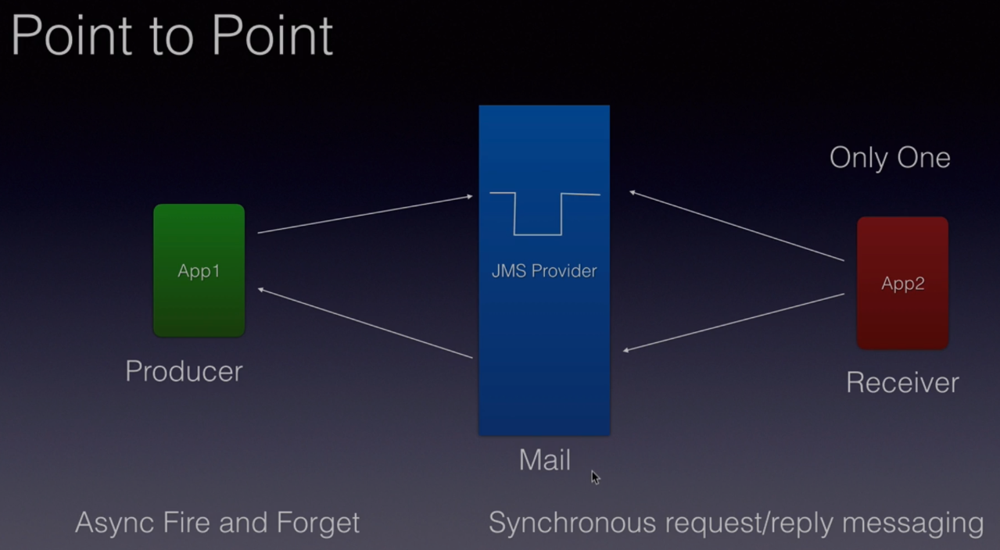

# Java Messaging Service, JMS Fundamentals
### by Bharath Thippireddy, Udemy

The courser will make use of APIs JMS 1.x and JMS 2.x. For the JMS provider we'll use **Apache ActiveMQ Artemis**.
We will deploy a Java EE application in Jboss.

Outline:
1. What is messaging and why to use them.
2. What is JMS
3. Types of messages: Point-to-point (P2P) and Publisher-Subscriber (PUB-SUB)
4. Anatomy of a message: Headers, Properties and Payload
5. Load balancing in P2P.
6. Durable and Sharable Subscriptions in PUB-SUB
7. Filtering messages
8. Message guarantee: Acknowledgment and Transaction

The course is divided into 14 sections. I will organize my notes per section.

## 2. Messaging Basics
Messaging is the process of exchanging business data or information across applications, or across components within the same application. The components of a messaging system are:
1. The message: contains the business data as well as networking or routing headers.
2. Sender (an application)
3. Receiver (an application)
4. The Messaging Server, or MOM (Message Oriented Middleware): takes the incoming message and ensure it is delivered to the proper receiver.

The Messaging Server provides useful services such as fault tolerance, load balancing, scalability, transaction management among others. Example of MOMs (JMS providers) are:
- Apache ActiveMQ
- SonicMQ
- IBM WebsphereMQ
- TibcoMQ
- RabbitMQ

  
  
## Messaging advantages
A messaging server decouples the sender and receiver applications allowing for heterogeneous integration. Each application can be a service or a micro-service, developed in different programming languages and running on completely different environments. Moreover, they can be replaced at any time, as they will all fallow the same (abstract) contract set by the MOM. This **increase the flexibility** of our application, also good for microservices.

Before messaging came in, applications communication was made through a database or making remote procedural calls. This introduced tight coupling among applications ?. Messaging brought in the desired **loose coupling**, making applications need to know nothing about each other. All the request and response process is now mediated through the MOM. 

Compared to web services (HTTP request/response), MOMs are more reliable as request and response messages are persisted, so there are much fewer chances they are lost.

Messaging also **reduce system bottlenecks** and **increase scalability**. If a queue only has one receiver application and there are much more messages in the queue than the app can process, we can introduce more instances of the same consumer application set to listen the same queue. In other words, we can spin off more instances of the consumer application as the load increase, and they will work asynchronously !

## What is JMS
JMS is a specification for messaging services in Java applications. It is maintained by Oracle. All Messaging Servers, irrespective of the vendor, must implement it. Developers use the APIs JMS provides. The current version of JMS is 2.0, and it is a big improvement over the earlier version 1.2.

**JMS is for messaging what JDBC is for databases**.

## The two messaging models
JMS supports two types of messaging models: Point-to-Point and Publish/Subscriber.

### Point-to-Point
The Point-to-Point (P2P) messaging model allows sending and receiving messages both synchronously and asynchronously, through channels called **queues**. The JMS provider allow creating queues. There will be a Producer, or Sender, application adding messages to the queue. And there will be a Receiver, or Consumer, application taking the messages from the queue.

In Point-to-Point messaging the message that is put into the queue is consumed by only one application and then removed from the queue. The JMS provider will ensure this.
 
P2P messaging supports **asynchronous fire and forget**, which means that the producer application will send the message to the JMS provider and will forget it. The consumer application will then consume and process it however it wants. However, it also supports **synchronous request/replay messaging**. In this case, after the producer applications send a message to the queue, the consumer application receives it, process it, and send a message back to the producer app. through a different queue. The producer will read this message as a response.

### Publish/Subscribe
In the Publish/Subscribe (PUB-SUB) messaging model

